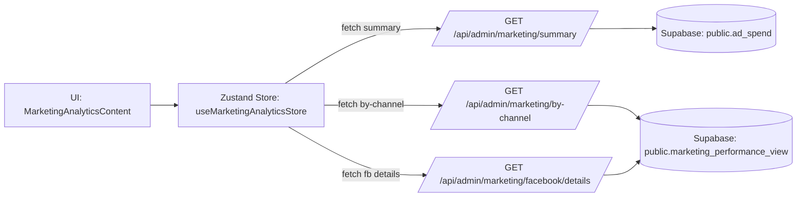

# Admin Marketing Analytics – Phase 1: Audit and Hardening

Date: 2025-09-30
Owner: Engineering
Related area: Admin Dashboard Marketing Tab

## Task Objective
Audit the Admin “Marketing” tab and its backend to ensure correctness, performance, security, and alignment with project conventions. Produce a prioritized plan to fix gaps (missing API, aggregation correctness, date handling, caching, and DX cleanups).

## Current State Assessment

- **Entry point:** `app/admin/page.tsx` renders a Marketing tab via `TabsContent` -> `MarketingAnalyticsContent`.
- **Marketing tab module:** `app/admin/marketing/MarketingAnalyticsContent.tsx` (client)
  - Uses `useMarketingAnalyticsStore()` from `lib/stores/admin/marketingAnalyticsStore.ts`.
  - Renders filters, summary cards, channel table, and Facebook ads detail table.
- **UI components:**
  - `MarketingFilters.tsx` uses `components/ui/date-range-picker.tsx` to pass `startDate`/`endDate` as ISO strings.
  - `MarketingMetricCards.tsx` shows Total Ad Spend; other metrics are blocked with notes until attribution is ready.
  - `MarketingChannelComparison.tsx` displays spend/impressions/clicks/enrollments per channel.
  - `FacebookAdsDetailTable.tsx` expects ad-level rows (date, campaign/adset/ad names/ids, spend, impressions, clicks).
- **Client store:** `lib/stores/admin/marketingAnalyticsStore.ts`
  - Manages `dateRange`, `summaryData`, `channelData`, `facebookDetailsData` with loading/error states.
  - Fetches data from:
    - `GET /api/admin/marketing/summary`
    - `GET /api/admin/marketing/by-channel`
    - `GET /api/admin/marketing/facebook/details` (missing)
  - Caches on `lastFetchedFilters` using `lodash-es` `isEqual`.
- **API routes:**
  - `app/api/admin/marketing/summary/route.ts`: selects `spend` from `public.ad_spend`, reduces in Node.
  - `app/api/admin/marketing/by-channel/route.ts`: selects from `public.marketing_performance_view`, aggregates per `source_channel` in Node.
- **Database and types:**
  - `types/supabase.ts` contains `Views.marketing_performance_view` (fields include `source_channel`, `date`, `spend`, `impressions`, `clicks`, `attributed_revenue`, `enrollment_id`).
  - Migration: `supabase/migrations/20250420084404_create_facebook_ads_schema.sql` creates `ad_*` tables and `ad_spend`.
- **Security:** API routes validate admin via `validateAdminStatus(user.id)`; queries run with SSR anon client from `lib/supabase/server.ts`.

## Future State Goal
Deliver a robust Marketing tab that:
- Correctly aggregates metrics (no double counting),
- Handles date filters predictably,
- Scales with server-side aggregation and pagination,
- Adheres to project naming/export conventions,
- Enforces admin-only access under RLS,
- Provides clear error states and reliable client caching.

## Implementation Plan

Step 1: Close Gaps in Data Endpoints
- [ ] Implement `GET /api/admin/marketing/facebook/details` to provide ad-level rows from `marketing_performance_view` with fields: `date, campaign_id/name, adset_id/name, ad_id/name, spend, impressions, clicks`.
- [ ] Add server-side pagination (`limit`, `offset`, defaults) and ordering (e.g., `date desc`).
- [ ] Normalize date filters to `YYYY-MM-DD` server-side; validate ranges (start <= end).

Step 2: Correctness of Aggregations
- [ ] Update `by-channel` endpoint to compute aggregations in SQL using `GROUP BY source_channel` and `COUNT(DISTINCT enrollment_id)`.
- [ ] If short-term patch is needed, de-duplicate enrollment counts in Node with a per-channel Set (temporary until SQL refactor).

Step 3: Performance Improvements
- [ ] Optimize `summary` endpoint to compute `SUM(spend)` in SQL (view or RPC) instead of returning all rows and reducing in Node.
- [ ] Add pagination limits to all detail-style endpoints; consider caching headers or incremental hydration if needed.

Step 4: Client Store Reliability
- [ ] Move `lastFetchedFilters` update to a single post-`fetchAll` success point, or maintain per-section cache states to avoid race conditions.
- [ ] Add basic retry/backoff for transient server errors and smarter handling for 401/403 (show admin access error).

Step 5: Security & RLS Verification
- [ ] Verify RLS allows admin to read `ad_spend` and `marketing_performance_view` when authenticated as admin (SSR anon session + server-side admin check). If necessary, add policies guarded by a `check_admin_access()` function or equivalent.

Step 6: DX & Conventions
- [ ] Remove unused imports:
  - `app/admin/page.tsx`: `cookies`, `createServerSupabaseClient`, `Database`, and unused icons.
  - `app/admin/marketing/components/MarketingFilters.tsx`: unused `Button`.
  - API routes: unused `Database`.
- [ ] Align file names to kebab-case and prefer named exports for components in `app/admin/marketing/`.
- [ ] Remove unused placeholder `components/admin/marketing-section.tsx` if not referenced.

Step 7: Testing & Validation
- [ ] Add unit tests for API endpoints (aggregation correctness, date filtering, pagination).
- [ ] Add an integration/E2E test path for admin users: verify summary and channel data load with filters.
- [ ] Validate “no data” states in all widgets render friendly messages.

Step 8: Documentation & Monitoring
- [ ] Document endpoints, query params, and response shapes in `docs/`.
- [ ] Track latency and response sizes for endpoints; watch for growth.

## Detailed Findings

- **Missing API endpoint (blocking UI):** Store calls `GET /api/admin/marketing/facebook/details`, but no route exists under `app/api/admin/marketing/facebook/details/route.ts`. This prevents `FacebookAdsDetailTable` from loading details.
- **Aggregation risk (double counting):** `by-channel` route increments `enrollments` for each row that has `enrollment_id`. If the view yields multiple rows for the same enrollment (e.g., multiple ads or dates), totals will be inflated. Use `COUNT(DISTINCT enrollment_id)` or pre-aggregate by channel+enrollment.
- **Date filters:** Client sends ISO strings via `toISOString()`. Server applies `gte/lte` on a `date` column. This can be timezone-sensitive and lead to off-by-one issues. Normalize server-side to `YYYY-MM-DD` and validate ranges.
- **Summary performance:** `summary` currently returns all `spend` rows and reduces in Node. Use SQL `SUM(spend)` (RPC or direct aggregation) with optional date predicate to reduce I/O and memory.
- **Store cache race:** Each individual fetch method writes `lastFetchedFilters` after success; `fetchAll` runs `Promise.all`. One success can cause subsequent identical filter runs to be skipped, potentially leaving stale sections. Centralize cache state or track per-section.
- **Pagination & sorting:** Details endpoint needs pagination and sorting to prevent large payloads and long tables. Channel endpoint may also benefit from limits if it ever grows (less likely).
- **Security & RLS:** Admin check is done in code (`validateAdminStatus`), but queries run under SSR anon session. Ensure RLS for `ad_spend` and the view permits admin reads; otherwise endpoints may 401/403 despite admin check.
- **Conventions & cleanup:** Several unused imports and PascalCase filenames in `app/admin/marketing/`. Project guidelines prefer kebab-case and named exports.

## Data Flow (Mermaid)

## Acceptance Criteria

- **Functional:**
  - Marketing tab loads summary, channel comparison, and Facebook ad details without errors for admin users.
  - Date range filters produce consistent results across all sections.
  - Channel enrollments reflect `COUNT(DISTINCT enrollment_id)` (no double counting).
  - Details endpoint supports pagination and descending date sorting by default.
- **Performance:**
  - Summary endpoint aggregates in SQL (not by reducing all rows in Node).
  - API response times remain stable under realistic data sizes.
- **Security:**
  - Admin-only access enforced; RLS policies permit admin reads without exposing data to non-admin users.
- **DX & Consistency:**
  - No unused imports; files follow kebab-case; components use named exports.
  - Errors are surfaced meaningfully to the UI with actionable messages.

## Risks & Mitigations

- **RLS misconfiguration:** Admin route passes but query returns 401/403. Mitigate by adding explicit RLS policies gated by `check_admin_access()` and test with admin/non-admin users.
- **Large dataset growth:** Node-side aggregation may become slow. Mitigate by moving aggregations to SQL or materialized views.
- **Timezone edge cases:** Normalize filters to calendar dates on server; add tests for midnight boundaries.
- **Client cache staleness:** Centralize `lastFetchedFilters` handling and add per-section freshness checks.

## References

- `app/admin/page.tsx`
- `app/admin/marketing/MarketingAnalyticsContent.tsx`
- `app/admin/marketing/components/MarketingFilters.tsx`
- `app/admin/marketing/components/MarketingMetricCards.tsx`
- `app/admin/marketing/components/MarketingChannelComparison.tsx`
- `app/admin/marketing/components/FacebookAdsDetailTable.tsx`
- `lib/stores/admin/marketingAnalyticsStore.ts`
- `app/api/admin/marketing/summary/route.ts`
- `app/api/admin/marketing/by-channel/route.ts`
- `lib/supabase/server.ts`, `lib/supabase/admin.ts`
- `types/supabase.ts` (Views.marketing_performance_view)
- `supabase/migrations/20250420084404_create_facebook_ads_schema.sql`
