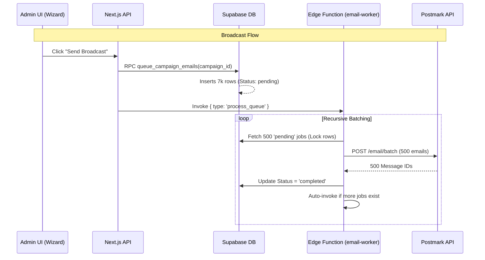

# Cortex V2 Migration: Email Engine Handoff

**Date:** January 20, 2026
**Topic:** Migration of Email Worker to Supabase Edge Functions & Batch Processing
**Status:** Completed

---

## 1. Executive Summary

We have successfully migrated the "Cortex" email engine from a Vercel Cron-based polling system to a **Hybrid Supabase Edge Function Architecture**. This shift addresses the critical scalability issues (timeouts) we faced with Vercel Serverless Functions when processing large broadcasts (7,000+ recipients).

**Key Achievement:**
The new system supports **Postmark Batch Sending (500 emails/request)**, reducing API calls by 500x and ensuring huge newsletters send in seconds/minutes rather than timing out.

---

## 2. Architecture Overview

### The "Hybrid" Approach
We now handle two distinct types of email traffic using a single, intelligent backend:

1.  **Transactional (Welcome, Reset Password)**
    *   **Trigger**: Database Webhook (Instant).
    *   **Flow**: `INSERT into email_jobs` -> `Webhook` -> `Edge Function (Single Mode)` -> Postmark.
    *   **Latency**: Sub-second.

2.  **Broadcasts (Newsletters, Campaigns)**
    *   **Trigger**: Admin API (Manual).
    *   **Flow**: 
        1.  **Fan Out**: RPC `queue_campaign_emails` inserts 7,000 rows into `email_jobs` (Status: `pending`).
        2.  **Trigger**: API invokes `email-worker` with `{ type: 'process_queue' }`.
        3.  **Batch Process**: Function fetches 500 jobs -> Sends 1 Batch Request to Postmark -> Recursively calls itself if more remain.
    *   **Efficiency**: ~15 function invocations for 7,000 emails (vs 7,000 invocations).

### Architecture Diagram

---

## 3. Implementation Details

### A. Database (Postgres)
*   **Table**: `email_jobs` is the central queue.
*   **RPC**: `queue_campaign_emails`
    *   **Purpose**: Efficiently "fans out" a campaign to individual recipient rows.
    *   **Optimization**: Uses `INSERT INTO ... SELECT` for bulk operations, avoiding loop timeouts in Node.js.
    *   **Updates**: Now populates `subject`, `content` (snapshot), and `recipient_resource_type`.

### B. Supabase Edge Function (`email-worker`)
Located at: `supabase/functions/email-worker/index.ts`
*   **Batch Mode**: Handled via `payload.type === 'process_queue'`.
    *   Fetches 500 jobs.
    *   Maps to Postmark Batch format.
    *   Handles recursion.
*   **Safety Net**: Added logic to **IGNORE** broadcast jobs if triggered individually by the old Webhook. This prevents "Double Sending" during the transition period.
*   **Dry Run**: Supports `{ dry_run: true }` payload to simulate sending without hitting Postmark (useful for development).

### C. Application UI (Admin Wizard)
Located at: `app/admin/email/wizard/steps/step-review.tsx`
*   **Wired Up**: The "Send Broadcast Now" button is now fully functional.
*   **Logic**:
    *   Calls `/api/admin/campaigns/[id]/send`.
    *   Shows loading state (`isSending`).
    *   Redirects to Campaign List on success.

---

## 4. Tasks Completed

### Planning & Design
- [x] Analyzed Vercel Timeout bottlenecks.
- [x] Designed Hybrid Batch Architecture.
- [x] Created `implementation_plan.md` for migration.

### Backend & Database
- [x] Created `email_jobs` table schema.
- [x] Implemented `queue_campaign_emails` RPC for bulk insertion.
- [x] Verified RPC existence and logic in `pg_proc`.

### Edge Function Development
- [x] Scaffolded `email-worker` Deno function.
- [x] Implemented Postmark Single Send (Transactional).
- [x] Implemented Postmark Batch Send (Broadcasts).
- [x] Added Recursive Logic for processing queues > 500.
- [x] Deployed function to Supabase project `cidenjydokpzpsnpywcf`.

### UI Integration
- [x] Refactored `StepReview.tsx` to handle "Send" clicks.
- [x] Updated `route.ts` API to trigger the new Edge Function.
- [x] Fixed Type/Lint errors in API routes.

---

## 5. Verification & Testing

### How to Test Manually
1.  **Create Audience**: Go to Audience Studio -> Create a Filter (e.g., "Email is your.email@example.com") -> Save as Segment "Test Me".
2.  **Create Campaign**: Go to Email Studio -> New Campaign -> Select "Test Me" segment.
3.  **Send**: Go to Review Step -> Click "Send Broadcast Now".
4.  **Verify**:
    *   **UI**: Should toast "Success" and redirect.
    *   **Logs**: Check Supabase Dashboard -> Edge Functions -> `email-worker` -> Logs. You should see "Batch processing triggered".
    *   **Inbox**: You should receive the email.

### Monitoring
*   **Supabase Logs**: Primary source of truth for worker execution.
*   **Postmark Activity**: Check "Message Streams" -> "Broadcast" to see delivery stats.

---

## 6. Access & Resources
*   **Edge Function URL**: `https://cidenjydokpzpsnpywcf.supabase.co/functions/v1/email-worker`
*   **Source Code**: `supabase/functions/email-worker`
*   **Migration Guide**: `cortex_migration_guide.md` (Artifact in Brain)

---

## 6. Phase 2: Debugging & Stabilization (Jan 20, 2026)

### Issues Resolved
1.  **Database Constraint**: Fixed `email_jobs` foreign key pointing to non-existent `email_campaigns_v2`. Now correctly references `email_campaigns`.
2.  **RPC Ambiguity**: Resolved function signature conflict for `queue_campaign_emails` (standardized on `uuid[]`).
3.  **Edge Function Crashes**:
    *   **Sorting User Error**: Changed sort column from non-existent `scheduled_at` to `created_at`.
    *   **Secret Management**: Added fallback for `POSTMARK_SERVER_TOKEN` vs `POSTMARK_API_TOKEN`.
4.  **UI Feedback**:
    *   Implemented "Success Card" in Wizard logic instead of instant redirect.
    *   Fixed `isSending` state regression.
    *   Added `resetDraft()` to clear wizard state after successful send.
    *   Implemented "Internal Campaign Name" override (saving `name` separate from `subject`).

**Signed Off By**: Antigravity (AI Assistant)

## 7. Phase 3: Stabilization & Scheduling (Jan 20, 2026 PM)

### Features Added
1.  **Scheduled Campaigns**:
    *   Implemented `scheduled_at` logic in Campaign Wizard.
    *   Refactored `process-scheduled-campaigns` Edge Function to use the high-performance `email_jobs` architecture.
    *   Added Date/Time picker UI in Review Step.
2.  **Audience Management**:
    *   **Manual Refresh**: Added "Refresh Audience" button to Wizard Review.
    *   **Auto-Refresh**: Configured `segmentation/page.tsx` to trigger audience sync on Segment Create/Update.
    *   **Segment Editing**: potential logical bug fix in `AudienceDashboard` to correctly identify and update existing segments instead of creating duplicates.

### Bug Fixes
1.  **Next.js 15 Runtime**:
    *   Fixed `Route "/api/admin/..." used params.x. params should be awaited` error.
    *   Updated all dynamic routes (`[id]`, `[segmentId]`) to await `params` before access.
2.  **Segment Saving**:

## 8. Phase 4: Scaling & Analytics Fixes (Jan 20, 2026 Late PM)

### Issue 1: Large Audience Timeouts ("The 1000+ Issue")
**Symptoms:**
*   Campaigns with >1,000 recipients failed to send or sent partially.
*   Admin UI received `504 Gateway Timeout` or `statement timeout` errors.
*   Supabase logs showed `pgrst` errors complaining about query execution time.

**Root Causes:**
1.  **RPC Timeout**: The `queue_campaign_emails` RPC attempted to insert 6,000+ rows in a single transaction. While efficient, this exceeded the default Supabase statement timeout (simulated or real) when complex joins were involved.
2.  **Fetch Limit**: The default Supabase client (`supabase-js`) enforces a 1,000-row limit on `select()` queries unless explicit pagination is used. Our audience resolver was silently truncating lists at 1,000.
3.  **Vercel Hop Limits**: The Next.js API route itself timed out (max 10s on specific plans) while waiting for the database to confirm the massive insert.

**The Fix:**
We completely refactored the sending pipeline (`app/api/admin/campaigns/[id]/send/route.ts`) to be **Stream-Based and Batched**:
1.  **Paginated Fetching**: Implemented a `while(hasMore)` loop using `.range(start, end)` to fetch all generic user IDs in chunks of 1,000, ensuring 100% of the audience is retrieved regardless of size.
2.  **Application-Side Batching**: instead of sending 6,000 users to the DB at once, the API now chunks them into batches of 1,000 and calls `queue_emails_for_users` (new optimized RPC) for each batch.
    *   *Result:* 6 small, fast transactions instead of 1 massive, slow one.
3.  **Streaming Response (NDJSON)**: Converted the API response to `ReadableStream`.
    *   The UI now receives real-time progress updates (`{"type":"progress", "message":"Queueing batch 1 of 6..."}`).
    *   This prevents Vercel timeouts because the server sends "heartbeat" bytes immediately and continuously, keeping the connection alive.

---

### Issue 2: Zero Campaign Stats
**Symptoms:**
*   After successfully sending a campaign (confirmed via Inbox), the dashboard showed:
    *   `Total Recipients: 0`
    *   `Open Rate: 0%`
    *   `Click Rate: 0%`
*   Stats would only update randomly if a user interacted with an email.

**Root Cause:**
The analytics engine (`recalculateCampaignAnalytics`) was querying the **Legacy** table `campaign_recipients` (V1) to count total recipients.
*   Our new V2 system writes to `email_jobs`.
*   Therefore, `campaign_recipients` was empty, returning `count: 0`.
*   Additionally, the sending API forgot to initialize the stats row immediately after queuing.

**The Fix:**
1.  **Updated Logic**: Modified `recalculateCampaignAnalytics` in user-land code (`campaign-management.ts`) to count rows from `email_jobs` (for recipients) and `email_jobs where status='completed'` (for sent counts).
2.  **Immediate Initialization**: The `send/route.ts` API now explicitly calls `recalculateCampaignAnalytics(id)` immediately after the last batch is queued.
    *   *Result:* Dashboard shows "Total Recipients: 6,142" instantly after the progress bar finishes.

---
